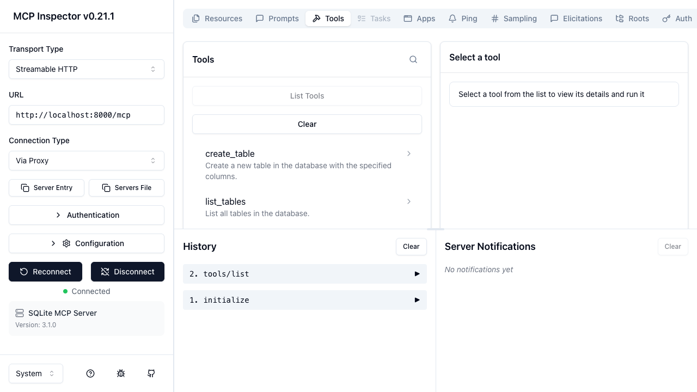
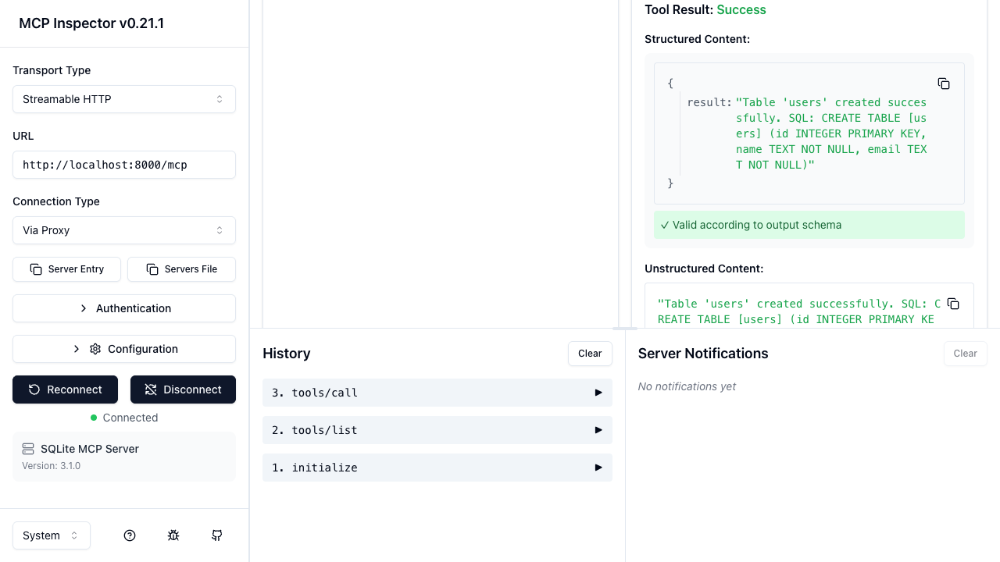

# SQLite MCP Server

A fully-featured MCP (Model Context Protocol) server built with [FastMCP](https://github.com/jlowin/fastmcp) that provides complete CRUD access to a SQLite database. Clients like Claude Desktop, Claude Code, or any MCP-compatible tool can create tables, insert rows, query data, update records, and manage schema — all through MCP tools.

> **Built autonomously** by an AI coding agent using the [Ralph Loop](https://ghuntley.com/ralph) pattern — iterative fresh-context sessions with persistent file-based state.

## Screenshots

### MCP Inspector — Tool Discovery
Connected via Streamable HTTP to the running server, showing all 9 available tools:



### MCP Inspector — Tool Execution (E2E)
Executing `create_table` through the Inspector UI — the server receives params, executes SQL, and returns confirmation:



## Features

- **9 database tools** — create/drop tables, insert/batch-insert/query/update/delete rows
- **4 resource endpoints** — table list, schema, row counts, database stats
- **HTTP by default** — serves on port 8000, also supports STDIO for Claude Desktop
- **22 automated tests** — full test suite using FastMCP in-memory Client
- **Parameterized queries** — all SQL uses bind params to prevent injection
- **WAL mode** — concurrent read performance via SQLite Write-Ahead Logging

## Quick Start

### Installation

```bash
uv add fastmcp
```

### Running

**HTTP mode (default):**
```bash
uv run python server.py
# Server running at http://localhost:8000
```

**STDIO mode (for Claude Desktop / Claude Code):**
```bash
MCP_TRANSPORT=stdio uv run python server.py
```

**MCP Inspector (interactive testing):**
```bash
# Start the server first
uv run python server.py &

# Launch Inspector
npx @modelcontextprotocol/inspector
# Connect via Streamable HTTP → http://localhost:8000/mcp
```

### Claude Code Setup

Add to your `.mcp.json`:

```json
{
  "mcpServers": {
    "sqlite": {
      "command": "uv",
      "args": ["run", "python", "server.py"],
      "env": {
        "MCP_TRANSPORT": "stdio"
      }
    }
  }
}
```

## Tool Reference

| Tool | Params | Description |
|------|--------|-------------|
| `create_table` | `table_name`, `columns` (list of dicts with `name`, `type`, optional `primary_key`, `not_null`, `default`) | Create a new table. Supported types: TEXT, INTEGER, REAL, BLOB, BOOLEAN, DATETIME |
| `list_tables` | *(none)* | List all tables in the database |
| `describe_table` | `table_name` | Get column info (name, type, nullable, default, primary key) |
| `drop_table` | `table_name` | Drop a table from the database |
| `insert_row` | `table_name`, `data` (column-value dict) | Insert a single row, returns row ID |
| `insert_rows` | `table_name`, `rows` (list of dicts) | Batch insert using `executemany` |
| `query` | `sql` (SELECT only), `params` (optional) | Query data, returns list of dicts (max 1000 rows) |
| `update_rows` | `table_name`, `data`, `where`, `params` | Update rows matching WHERE clause |
| `delete_rows` | `table_name`, `where`, `params` | Delete rows matching WHERE clause |

**Safety:** `update_rows` and `delete_rows` require a WHERE clause. The `query` tool rejects non-SELECT statements.

## Resource Reference

| URI | Description |
|-----|-------------|
| `db://tables` | JSON array of all table names |
| `db://tables/{table_name}/schema` | Column definitions for a table |
| `db://tables/{table_name}/count` | Row count for a table |
| `db://stats` | Database file size, table count, total rows |

## Testing

Run the full test suite (22 tests):

```bash
uv run pytest test_server.py -v
```

Tests cover:
- **Table management** — create, describe, drop, duplicate detection
- **CRUD operations** — insert, batch insert, query, update, delete
- **Safety checks** — WHERE clause enforcement, SELECT-only validation
- **Resources** — all 4 resource endpoints
- **Edge cases** — 1000-row query limit, WAL mode, empty tables, constraint violations

## Configuration

| Environment Variable | Default | Description |
|---------------------|---------|-------------|
| `SQLITE_DB_PATH` | `data/database.db` | Path to the SQLite database file |
| `MCP_TRANSPORT` | `http` | Transport mode: `http` (port 8000) or `stdio` |

## Project Structure

```
server.py           — FastMCP server with 9 tools and 4 resources
test_server.py      — 22 pytest tests using FastMCP in-memory Client
pyproject.toml      — Dependencies (fastmcp, pytest, pytest-asyncio)
data/               — Default SQLite database directory
screenshots/        — MCP Inspector screenshots
```
